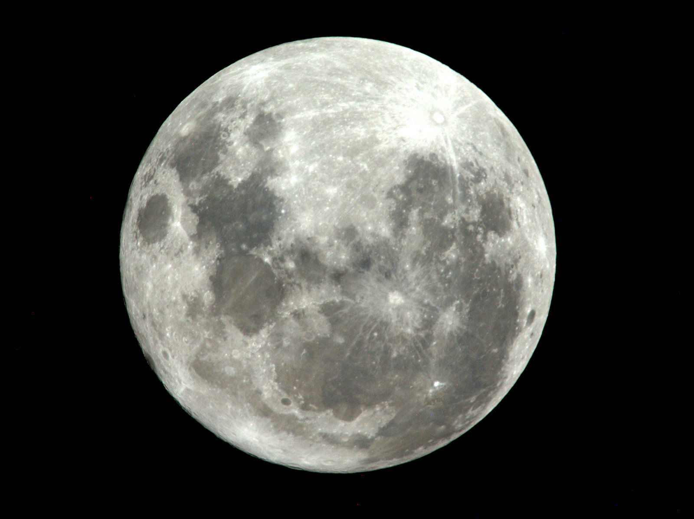

# Lune

La Lune est l'unique satellite naturel de la Terre. 

Icone créée par [monkik](https://www.flaticon.com/authors/monkik) trouvée sur [flaticon](https://www.flaticon.com/).

## Caractéristiques

- Distance de la Terre : 384 400 km
- Gravité : 1,62 m/s²
- Âge : 4,53 milliards ans
- Période orbitale : 27 jours
- Rayon : 1 737,4 km
- Densité : 3,34 g/cm³
- Orbites : Terre
