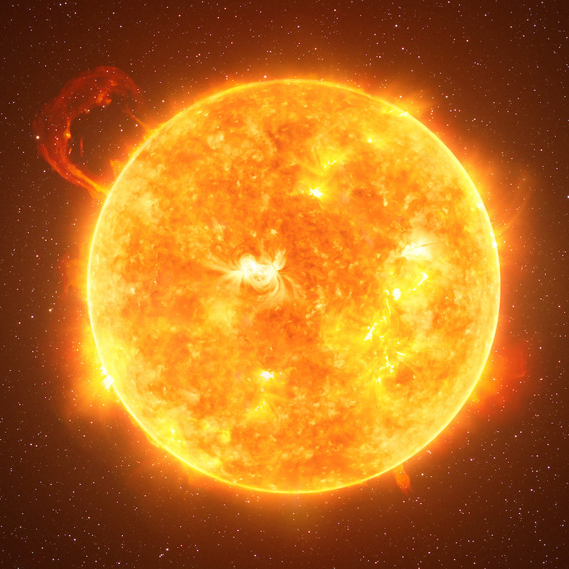

# Soleil

Le Soleil est l’étoile du Système solaire. 

Icone créée par [monkik](https://www.flaticon.com/authors/monkik) trouvée sur [flaticon](https://www.flaticon.com/).

## Caractéristiques

- Masse : 1.989 x 1030 kg
- Diamètre : 1392684 km
- Symbole : ☉;
